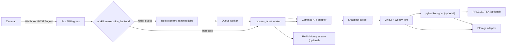
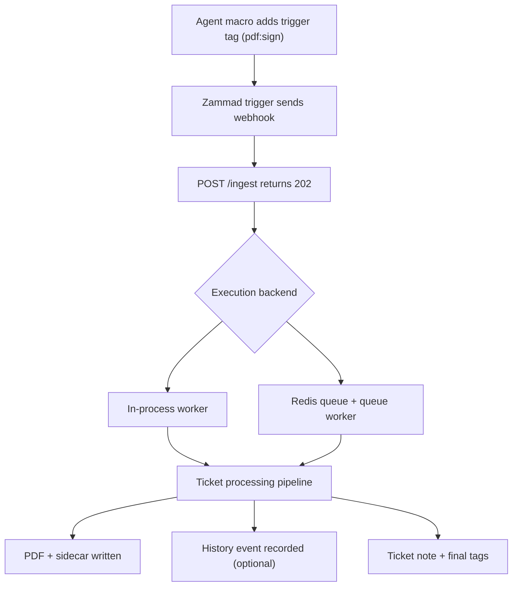
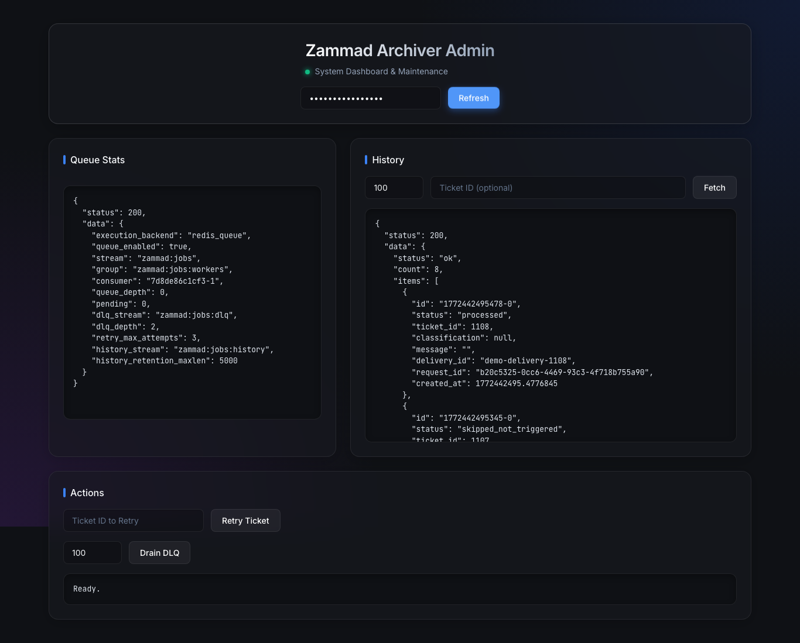
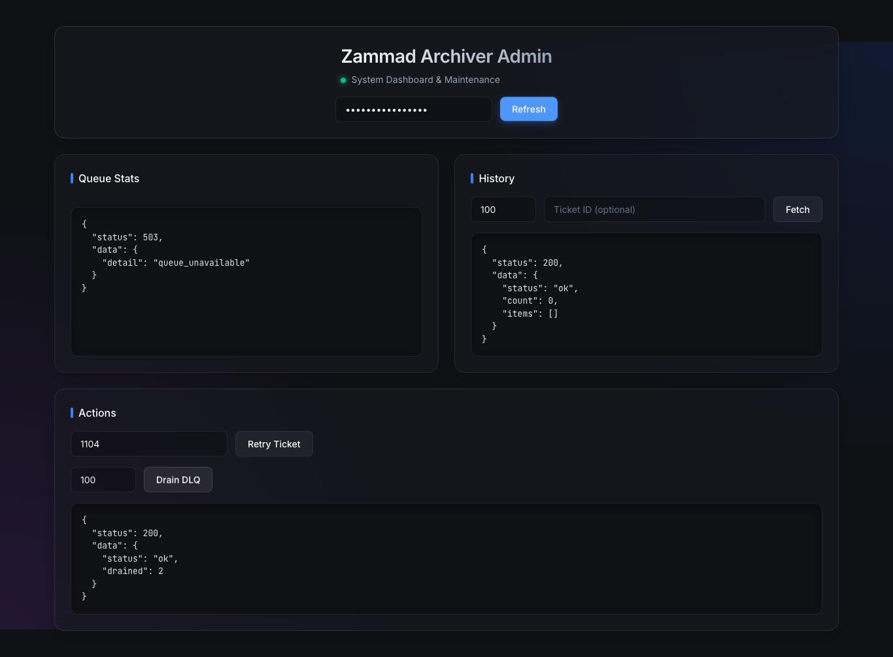
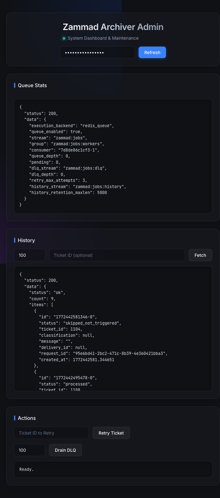

# zammad-ticket-archiver

[](https://github.com/sebastianspicker/zammad-ticket-archiver/actions/workflows/ci.yml)
[](https://github.com/sebastianspicker/zammad-ticket-archiver/actions/workflows/docker.yml)
[](LICENSE)
[](https://www.python.org/downloads/)

`zammad-ticket-archiver` is a FastAPI webhook service that archives Zammad tickets as PDF files on a filesystem target (local path or mounted CIFS/SMB).

Processing pipeline:

```
webhook -> fetch ticket data -> build snapshot -> render PDF
        -> optional sign -> optional timestamp
        -> store PDF + audit sidecar -> update ticket tags + note
```

## What It Does

- Exposes `POST /ingest` to receive Zammad webhooks.
- Fetches ticket, tags, and articles from Zammad REST API.
- Renders a PDF with Jinja2 templates + WeasyPrint.
- Optionally applies:
  - PAdES signature (PKCS#12/PFX)
  - RFC3161 timestamp token (TSA)
- Writes two files:
  - PDF
  - audit sidecar JSON (`<filename>.json`, for PDFs usually `...pdf.json`)
- Writes an internal note to the ticket and transitions archive tags.

## Scope

This repository provides:

- FastAPI service endpoints:
  - `POST /ingest`
  - `POST /ingest/batch`
  - `POST /retry/{ticket_id}`
  - `GET /jobs/{ticket_id}` (requires Bearer token via `ADMIN_BEARER_TOKEN`)
  - `GET /jobs/queue/stats` (requires Bearer token via `ADMIN_BEARER_TOKEN`)
  - `GET /jobs/history` (requires Bearer token via `ADMIN_BEARER_TOKEN`)
  - `POST /jobs/queue/dlq/drain` (requires Bearer token via `ADMIN_BEARER_TOKEN`)
  - `GET /admin` (requires Bearer or HTTP Basic auth via `ADMIN_BEARER_TOKEN`)
  - `GET /admin/api/*` (requires Bearer token via `ADMIN_BEARER_TOKEN`)
  - `GET /healthz`
  - `GET /metrics` (requires Bearer token via `METRICS_BEARER_TOKEN` when enabled)
- End-to-end ticket processing:
  1. receive webhook
  2. fetch ticket + tags + articles from Zammad
  3. build normalized snapshot model
  4. render PDF
  5. optionally sign and timestamp
  6. write PDF + sidecar JSON to storage
  7. update ticket note + tags
- Runtime hardening controls:
  - webhook HMAC verification
  - optional delivery ID requirement
  - request size limits
  - rate limiting
  - transport safety checks for upstream URLs

## Non-goals

Out of scope by design:

- exporting attachment binary payloads by default (attachments are metadata-only in snapshot/PDF; optional `pdf.include_attachment_binary` can write binaries to disk and the sidecar)
- archive browsing/search UI
- distributed durable queue by default (optional Redis queue backend is available)
- durable distributed idempotency store (default; optional Redis backend available)
- built-in retention/WORM policy engine
- built-in encryption-at-rest management
- multi-tenant isolation beyond path policy and external ACLs

## How Archiving Works

### Trigger Tag

Default trigger tag is `pdf:sign` (`workflow.trigger_tag`).

Processing behavior:
- `workflow.require_tag=true` (default): ticket is processed only when trigger tag is present.
- If ticket already has `pdf:signed`, processing is skipped.
- `POST /retry/{ticket_id}` and `POST /admin/api/retry/{ticket_id}` force one reprocessing run even when the trigger tag is absent or `pdf:signed` is already present.

### Required Ticket Fields

Defaults are configurable for the first two fields:
- `archive_path` (`fields.archive_path`, required)
- `archive_user_mode` (`fields.archive_user_mode`, optional, default `owner`)

`archive_user_mode` values:
- `owner`: use `ticket.owner.login`
- `current_agent`: use webhook `payload.user.login`, fallback `ticket.updated_by.login`
- `fixed`: use the custom field configured as `fields.archive_user` (default `archive_user`; required in this mode)

The field names for `archive_path`, `archive_user_mode`, and `archive_user` are configurable via `fields.*` in config or `FIELDS_ARCHIVE_PATH`, `FIELDS_ARCHIVE_USER_MODE`, `FIELDS_ARCHIVE_USER` in the environment.

### Tag State Transitions

- Start: `apply_processing()`
  - normal ingest: remove `pdf:error`, trigger tag
  - explicit retry/reprocess: also remove `pdf:signed`
  - add `pdf:processing`
- Success: `apply_done()`
  - remove `pdf:processing`, `pdf:error`, trigger tag
  - add `pdf:signed`
- Failure: `apply_error()`
  - remove `pdf:processing`, `pdf:signed`
  - add `pdf:error`
  - transient failures keep/re-add trigger tag
  - permanent failures remove trigger tag

## Architecture Overview



Detailed architecture and state diagrams:
- [`docs/01-architecture.md`](docs/01-architecture.md)

## Repository Map

- `src/zammad_pdf_archiver/runtime.py` and `asgi.py` load settings and create the FastAPI app.
- `src/zammad_pdf_archiver/app/routes/` contains the HTTP surfaces: ingest, retry/jobs, admin, health, and metrics.
- `src/zammad_pdf_archiver/app/jobs/` contains the asynchronous ticket-processing flow, Redis queue backend, history stream, and shutdown tracking.
- `src/zammad_pdf_archiver/adapters/` contains external IO: Zammad REST, snapshot building, PDF rendering, signing/TSA, Redis, and filesystem storage.
- `src/zammad_pdf_archiver/domain/` contains pure policy and data-model code: tag state, ticket IDs, path safety, audit records, and idempotency.
- `src/zammad_pdf_archiver/config/` contains settings, env/YAML loading, legacy env aliases, and cross-field validation.
- `scripts/` contains CI, ops, demo, and manual Docker E2E helpers.
- `test/static`, `test/unit`, `test/integration`, and `test/nfr` mirror the verification layers used by CI.

## High-Level Behavior



## Quickstart (Docker Compose)

Prerequisites:
- Docker with `docker compose`

**1. Clone and configure:**

```bash
git clone https://github.com/sebastianspicker/zammad-ticket-archiver.git
cd zammad-ticket-archiver
cp .env.example .env
```

**2. Edit `.env` with your values** (minimum required):

```bash
ZAMMAD_BASE_URL=https://your-zammad.example.com
ZAMMAD_API_TOKEN=your-api-token
STORAGE_ROOT=/mnt/archive
WEBHOOK_HMAC_SECRET=your-webhook-secret
```

> For test/dev without HMAC, set `HARDENING_WEBHOOK_ALLOW_UNSIGNED=true` instead of `WEBHOOK_HMAC_SECRET`.

**3. Start the service:**

```bash
docker compose up -d --build
```

**4. Verify the service is running:**

```bash
curl http://localhost:8080/healthz
# {"status":"ok","service":"zammad-pdf-archiver","version":"...","time":"..."}
```

The service is now ready to receive webhooks from Zammad on `POST /ingest`.

### Development Setup

For local development (lint, test, type-check):

```bash
# Install with dev dependencies
pip install -e ".[dev]"

# Start dev stack (hot-reload)
make dev

# Run validation
make lint          # ruff
make test          # pytest
make qa            # full QA (lint + mypy + all tests)
make verify        # QA + build
```

### Local Demo (Self-Contained)

Run a fully self-contained demo with a mock Zammad API:

```bash
make demo-up       # start demo stack (mock Zammad + Redis + archiver)
make demo-seed     # seed demo ticket data
make demo-shots    # capture admin UI screenshots (requires Playwright)
make demo-down     # tear down
```

### Screenshots (Admin Dashboard)

<details>
<summary>Click to expand admin dashboard screenshots</summary>






</details>

### Endpoints

| Method | Path | Auth | Description |
|--------|------|------|-------------|
| `POST` | `/ingest` | HMAC | Webhook ingestion |
| `POST` | `/ingest/batch` | HMAC | Batch webhook ingestion (max 100) |
| `POST` | `/retry/{ticket_id}` | Bearer | Re-process a ticket |
| `GET` | `/jobs/{ticket_id}` | Bearer | Job status for a ticket |
| `GET` | `/jobs/queue/stats` | Bearer | Queue statistics |
| `GET` | `/jobs/history` | Bearer | Processing history |
| `POST` | `/jobs/queue/dlq/drain` | Bearer | Delete dead-letter queue entries |
| `GET` | `/admin` | Bearer or Basic | Admin dashboard (optional) |
| `GET` | `/admin/api/*` | Bearer | Admin API (optional) |
| `GET` | `/healthz` | -- | Health check (supports `?deep=true`) |
| `GET` | `/metrics` | Bearer | Prometheus metrics (optional) |

See [`docs/api.md`](docs/api.md) for full request/response details.

## Configuration

Precedence (highest first):
1. Environment variables (including values loaded from `.env`)
2. Flat env aliases (backward-compat keys)
3. YAML config (`CONFIG_PATH`, or `config/config.yaml` when present)
4. Defaults in settings model

### Configuration Reference

| Resource | Description |
|----------|-------------|
| [`.env.example`](.env.example) | Annotated environment variable template |
| [`config/config.example.yaml`](config/config.example.yaml) | Full YAML configuration example |
| [`docs/config-reference.md`](docs/config-reference.md) | Complete key reference with defaults and env aliases |
| [`config/config.schema.json`](config/config.schema.json) | JSON Schema for editor autocompletion |

## Operational Notes

- All output paths are validated and confined under `storage.root`.
- Default storage writes are atomic (`storage.atomic_write=true`) and fsynced (`storage.fsync=true`).
- Signing requires `signing.enabled=true` and `signing.pfx_path`.
- Timestamping requires signing plus:
  - `signing.timestamp.enabled=true`
  - `signing.timestamp.rfc3161.tsa_url`
- TSA basic auth (if needed) uses env-only keys:
  - `TSA_USER`
  - `TSA_PASS`
- Delivery ID dedupe is in-memory only and resets on process restart. For consistent deduplication across restarts or multiple instances, use Redis (`workflow.idempotency_backend=redis`, `workflow.redis_url`); see [Operations](docs/08-operations.md).
- For `POST /ingest/batch`, a batch-level `X-Zammad-Delivery` header is expanded to per-item IDs of the form `<delivery-id>:<index>` before dedupe is applied.
- Processing after `202` is **best-effort** in default `inprocess` mode. For durable retries and dead-letter handling, enable `workflow.execution_backend=redis_queue` with `workflow.redis_url`; see [Processing and Idempotency](docs/08-operations.md#4-processing-and-idempotency-behavior).
- If a ticket is stuck in `pdf:processing` after a crash, see [Stuck in pdf:processing](docs/faq.md#why-is-a-ticket-stuck-with-pdfprocessing) in the FAQ.

Operational docs:
- [`docs/04-path-policy.md`](docs/04-path-policy.md)
- [`docs/06-signing-and-timestamp.md`](docs/06-signing-and-timestamp.md)
- [`docs/07-storage.md`](docs/07-storage.md)
- [`docs/08-operations.md`](docs/08-operations.md)
- [`docs/09-security.md`](docs/09-security.md)

## Validation Commands

```bash
make lint          # ruff linting
make test          # pytest (all tests)
make test-fast     # static + unit tests only
make qa            # full QA: lint + mypy + all test suites
make verify        # QA + sdist/wheel build
make smoke         # repo structure smoke check
make test-e2e      # manual Docker Compose API E2E lane
make dev           # Docker Compose dev stack (hot-reload)
```

## Documentation (index)

- [`docs/PRD.md`](docs/PRD.md) – Product Requirements Document
- [`docs/adr/`](docs/adr/) – Architecture Decision Records
- [`docs/01-architecture.md`](docs/01-architecture.md)
- [`docs/02-zammad-setup.md`](docs/02-zammad-setup.md)
- [`docs/03-data-model.md`](docs/03-data-model.md)
- [`docs/04-path-policy.md`](docs/04-path-policy.md)
- [`docs/05-pdf-rendering.md`](docs/05-pdf-rendering.md)
- [`docs/06-signing-and-timestamp.md`](docs/06-signing-and-timestamp.md)
- [`docs/07-storage.md`](docs/07-storage.md)
- [`docs/08-operations.md`](docs/08-operations.md)
- [`docs/09-security.md`](docs/09-security.md)
- [`docs/api.md`](docs/api.md)
- [`docs/config-reference.md`](docs/config-reference.md)
- [`docs/faq.md`](docs/faq.md)
- [`docs/release-checklist.md`](docs/release-checklist.md) – Release and deployment checklist
- [`docs/deploy.md`](docs/deploy.md) – Production deployment
- [`docs/demo-mock-university.md`](docs/demo-mock-university.md) – Local mock university demo stack and screenshot workflow

## Glossary

- **Audit sidecar**: JSON file written next to each PDF containing checksum and processing metadata.
- **Archive path**: ticket custom field defining path segments under storage root.
- **Archive user mode**: strategy that selects the first directory component (`owner`, `current_agent`, `fixed`).
- **Delivery ID**: `X-Zammad-Delivery` header used for best-effort in-memory deduplication.
- **HMAC**: webhook signature validation via `X-Hub-Signature: sha1=<hex>` or `sha256=<hex>`.
- **PAdES**: PDF Advanced Electronic Signatures profile.
- **RFC3161**: timestamp protocol used by Time Stamping Authorities.
- **TSA**: Time Stamping Authority endpoint used for timestamp tokens.
