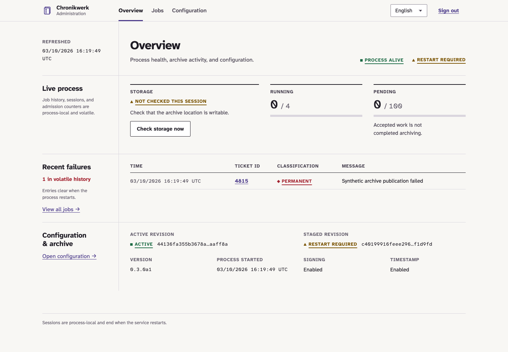
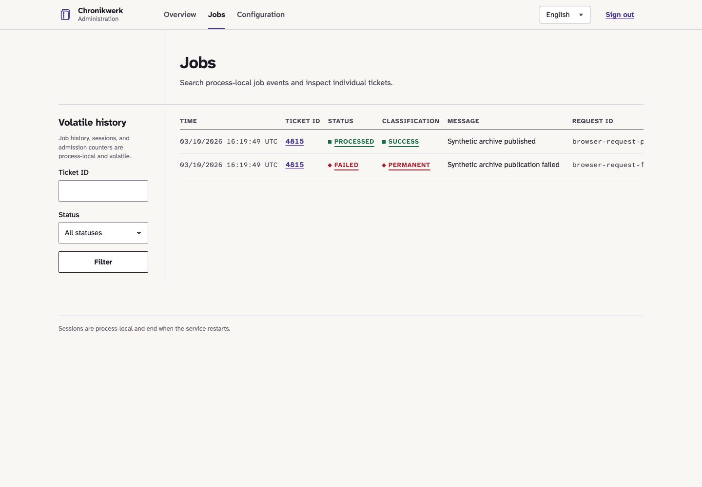
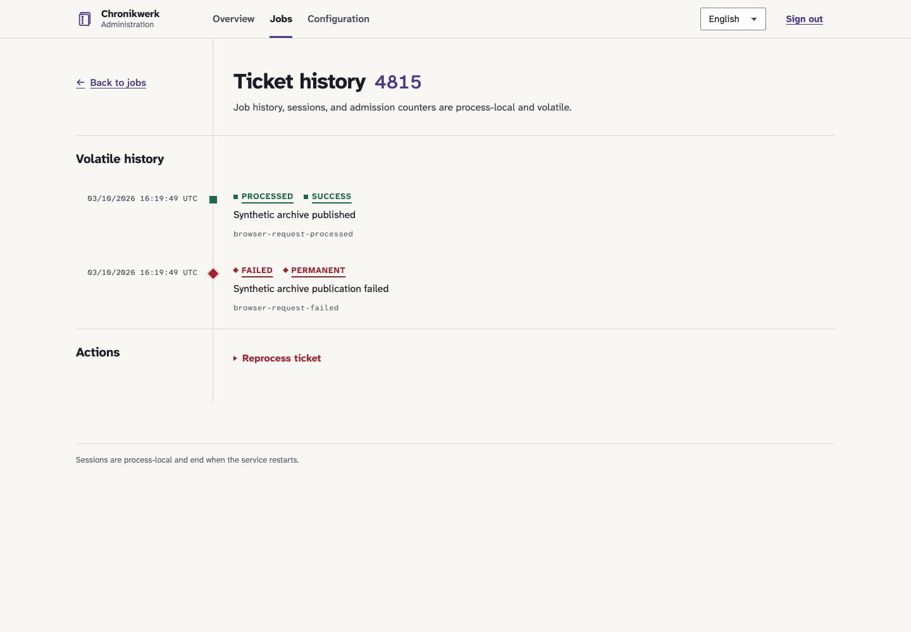
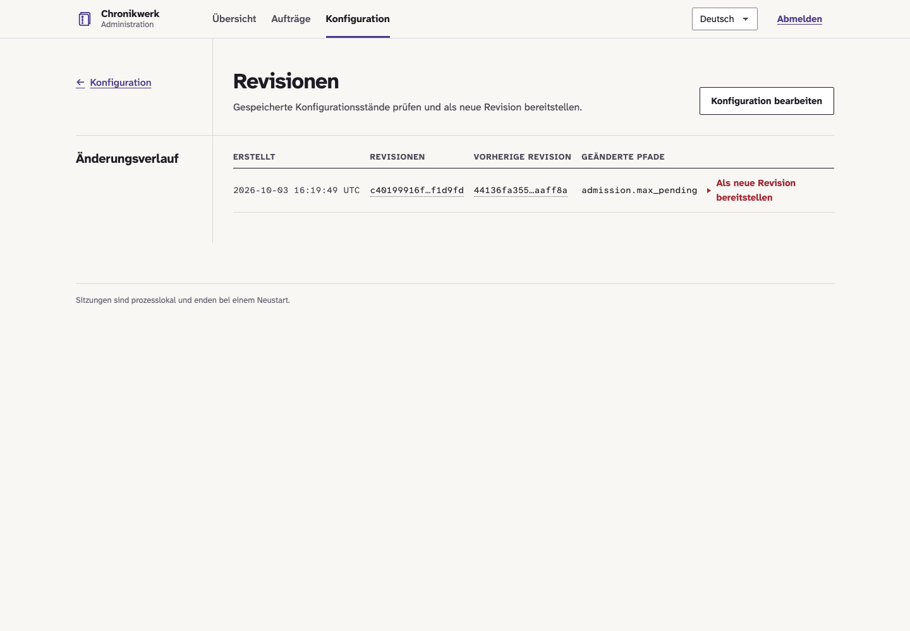
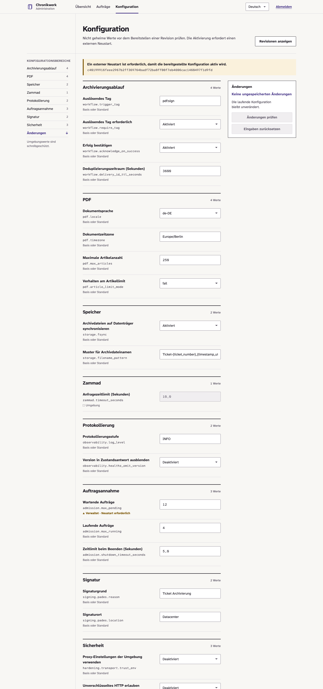

# Chronikwerk — Zammad Ticket Archiver

Auditable Zammad ticket archives in PDF and JSON.

<p>
  
</p>

[](LICENSE)
[](https://www.python.org/downloads/)
[](RELEASE_STATUS.md)
[](https://github.com/sebastianspicker/zammad-ticket-archiver/actions/workflows/ci.yml)
[](https://github.com/sebastianspicker/zammad-ticket-archiver/actions/workflows/pages-demo.yml)

Chronikwerk turns authenticated Zammad ticket events into a PDF plus a JSON audit sidecar, then
reports the result back in Zammad. It gives teams a verifiable copy of a ticket at the moment it
is archived, with optional PDF signing and RFC 3161 timestamping.

It runs as a single container beside your Zammad instance: a webhook arrives, Chronikwerk fetches
the current ticket, renders a stable PDF, writes the PDF and sidecar pair atomically to your
archive storage, and updates the ticket's tags.

Chronikwerk is an independent open-source project. It is not affiliated with, or endorsed by,
Zammad GmbH.

> [!IMPORTANT]
> Version `0.3.0a1` is an unfrozen, unpublished alpha candidate. Evaluate it with non-production
> data and read [RELEASE_STATUS.md](RELEASE_STATUS.md) before deploying anything real.

## Screenshot tour

The administration application is optional and disabled by default. Every image below is a real
render of the running service with synthetic local data, and you can click through the same
interface in the [static demo](https://sebastianspicker.github.io/zammad-ticket-archiver/) on GitHub Pages.

| Overview | Jobs |
| --- | --- |
| [](docs/screenshots/admin-overview.png) | [](docs/screenshots/admin-jobs.png) |
| **Ticket history** | **Configuration revisions** |
| [](docs/screenshots/admin-ticket.png) | [](docs/screenshots/admin-revisions.png) |



The interface ships in German and English. These are deterministic documentation renders, not
browser, accessibility, storage, signing, or release evidence. See
[docs/screenshots](docs/screenshots/README.md) for what they do and don't prove.

## What it does

- Accepts authenticated single-ticket and all-or-nothing batch webhooks.
- Reads tickets, articles, tags, and users through the Zammad REST API.
- Renders a sanitized, localized PDF with Jinja2 and WeasyPrint.
- Optionally applies a PAdES signature and an RFC 3161 timestamp.
- Writes under a confined archive root with symlink rejection and transactional PDF/sidecar
  publication.
- Projects the outcome back to Zammad with processing tags and a best-effort internal note.
- Offers optional process-local history, Prometheus metrics, and a small administration
  application for status, retries, and allowlisted non-secret configuration.

## What `202 Accepted` means

`POST /ingest` returns `202 Accepted` as soon as the request enters the in-process scheduler.
That is admission, not completion: a crash can still lose accepted work.

The sidecar file is the completion marker. Chronikwerk writes the PDF and sidecar before it
applies the terminal Zammad tags, so a finished archive always has a matching pair on disk even
if the final tag update fails. The success note is best effort after that.

Default tag transitions:

- Start: remove `pdf:error` and the trigger tag, then add `pdf:processing`.
- Success: remove processing/error/trigger tags, then add `pdf:signed`.
- Failure: remove `pdf:processing` and `pdf:signed`, then add `pdf:error`.

`pdf:signed` means the workflow succeeded — not that optional cryptographic signing ran. Check
the PDF and sidecar for signing status.

## Current limits

Chronikwerk is deliberately small. The alpha supports **one process and one instance**; durable
queues, leases, and multi-instance coordination are out of scope.

- Accepted work, job history, replay detection, ticket exclusion, and admin sessions are
  process-local and are lost on restart.
- Attachment metadata is rendered into the PDF, but attachment binaries are not archived.
- No archive search, retention engine, WORM policy engine, encryption manager, admin RBAC, SSO,
  secret editor, live reload, or UI-controlled restart.
- Archive ACLs, backups, retention, encryption, and network-filesystem behavior are operator
  responsibilities.
- Tagged-PDF output and automated browser checks do not by themselves prove PDF/UA or WCAG
  conformance.

See the [architecture](docs/01-architecture.md), [security model](docs/09-security.md), and
[alpha evaluation guide](docs/alpha-release.md) for the full boundaries.

## Requirements

**Production:** Linux, Docker Engine, Docker Compose 2.24+, a reachable Zammad instance, and
archive storage writable by container UID/GID `10001`.

**Local development:** Python 3.14+, Node.js 24–26, and the system libraries WeasyPrint needs.
Docker is required for container validation. PDF/UA validation uses veraPDF 1.30.1.

## Quick start

### Docker Compose

```bash
cp .env.example .env
```

Replace every placeholder and set at least:

```bash
ZAMMAD__BASE_URL=https://zammad.example.com
ZAMMAD__API_TOKEN=replace-with-zammad-api-token
ZAMMAD__WEBHOOK_HMAC_SECRET=replace-with-at-least-32-random-characters
STORAGE__ROOT=/mnt/archive
```

Then start the service:

```bash
docker compose up -d --build
docker compose ps
curl --fail --silent --show-error http://127.0.0.1:8080/healthz
```

The default Compose mapping publishes only on `127.0.0.1:8080`. The deep health check at
`/healthz?deep=true` creates and removes a file under `storage.root`; expose it only on a trusted
operator network.

### Development checkout

```bash
python3.14 -m venv .venv
. .venv/bin/activate
python -m pip install --only-binary=:all: --require-hashes -r requirements/tools.lock
python -m pip install --only-binary=:all: --require-hashes -r requirements/dev.lock
python -m pip install --no-deps --no-build-isolation -e .
npm ci --ignore-scripts
chronikwerk
```

The project does not publish an installation artifact yet. Install from a reviewed source
checkout or build a wheel with `make build`.

## Configuration

Configuration precedence, highest to lowest: process environment, managed non-secret overlay,
YAML, `.env`, file secrets, then model defaults. Nested environment keys use `__`. Validate the
effective configuration before startup:

```bash
chronikwerk-admin validate-config
chronikwerk-admin dump-config   # secrets are redacted
```

Use [config/config.example.yaml](config/config.example.yaml) as a YAML starting point. The full
schema, aliases, defaults, validation rules, and reviewed transport overrides live in the
[configuration reference](docs/config-reference.md).

## Zammad setup

The default trigger tag is `pdf:sign`. Chronikwerk reads the custom fields `archive_path`,
`archive_user_mode`, and `archive_user`. Follow the [Zammad setup guide](docs/02-zammad-setup.md)
to create the fields, configure the webhook HMAC, add workflow rules, and run a smoke test.

## Interfaces

| Interface | Authentication | Purpose |
| --- | --- | --- |
| `POST /ingest` | HMAC | Admit one Zammad webhook payload. |
| `POST /ingest/batch` | HMAC | Atomically admit up to 100 payloads. |
| `POST /retry/{ticket_id}` | Bearer token | Force one reprocessing attempt. |
| `GET /jobs/history` | Bearer token | Read optional process-local history. |
| `GET /healthz` | None | Shallow or deep storage check. |
| `GET /metrics` | Bearer token | Read optional Prometheus metrics. |
| `/admin/*` | Session and CSRF | Use the optional administration application. |
| `/docs`, `/redoc`, `/openapi.json` | None | FastAPI-generated API schema. |

Optional routes are registered only when enabled. Full request, response, HMAC, and admin
contracts are in the [API reference](docs/api.md).

Installed commands: `chronikwerk`, `chronikwerk-admin validate-config`,
`chronikwerk-admin dump-config`, `chronikwerk-admin list-config-revisions`, and
`chronikwerk-admin stage-config-rollback`. External ASGI servers can import
`chronikwerk.asgi:app`.

## Repository map

| Path | Purpose |
| --- | --- |
| `src/chronikwerk/` | Python service, templates, and packaged admin assets. |
| `frontend/` | TypeScript and modular CSS sources for the admin application. |
| `config/` | Complete example YAML configuration. |
| `tests/` | Unit, HTTP/Zammad contract, integration, static, and browser checks. |
| `scripts/ci/` | Deterministic validation, packaging, and image-smoke scripts. |
| `infra/systemd/` | Optional systemd wrapper around Docker Compose. |
| `demo/site/` | Mock-only source for the static administration demo. |
| `docs/` | Architecture, integration, operator, security, and release references. |

The browser-served files under `src/chronikwerk/web/static/admin/` are generated from `frontend/`
and intentionally committed as package data. `build/`, `dist/`, caches, virtual environments,
local configuration, credentials, admin state, and archive output are not source.

## Development and verification

Use the Makefile from the repository root:

| Command | Purpose |
| --- | --- |
| `make PYTHON=.venv/bin/python lint` | Run Ruff lint. |
| `make PYTHON=.venv/bin/python format` | Rewrite Python formatting. |
| `make PYTHON=.venv/bin/python typecheck` | Run mypy over the repository. |
| `make PYTHON=.venv/bin/python test-fast` | Run unit tests. |
| `make PYTHON=.venv/bin/python test` | Run all Python tests with coverage. |
| `make frontend-check` | Type-check and rebuild frontend assets, then compare packaged output. |
| `make docs-check` | Validate required Markdown, local links, and screenshot metadata. |
| `make PYTHON=.venv/bin/python verify-core` | Run the complete non-container gate. |
| `make PYTHON=.venv/bin/python verify` | Add the production-image smoke test. |

`make format`, `make frontend-update`, `make build`, and some check targets write files — review
their diffs. The separate PDF gate is:

```bash
make pdf-ua-check PDF_FILES="unsigned.pdf signed.pdf"
```

Contribution workflow and surface-specific checks are in [CONTRIBUTING.md](CONTRIBUTING.md).
Release-only external and manual gates are in the
[release checklist](docs/release-checklist.md).

## Static administration demo

`make dev` starts the real FastAPI service and needs real local configuration. For a
non-operational, mock-data-only visual reference, build the GitHub Pages artifact:

```bash
make PYTHON=.venv/bin/python pages-demo-check
python -m http.server 8000 --directory build/pages-demo
```

Open `http://localhost:8000/`. The demo uses synthetic tickets, jobs, configuration revisions,
and browser-local state. It makes no backend or external network requests and cannot archive a
ticket, write configuration, or contact Zammad. The Pages workflow deploys only this static
artifact from `main` or a manual run; it is not a Chronikwerk deployment.

## Deployment and operation

The maintained production path is [docker-compose.yml](docker-compose.yml), optionally wrapped by
[infra/systemd/chronikwerk.service](infra/systemd/chronikwerk.service). Put a trusted TLS proxy or
private ingress in front of the loopback bind. Do not expose the admin application, metrics, deep
health, or FastAPI documentation to untrusted networks.

Use the [deployment guide](docs/deploy.md) for host layout, signing mounts, and startup, and the
[operations runbook](docs/08-operations.md) for shutdown, update, rollback, monitoring,
reconciliation, retry, and troubleshooting.

## Documentation

The [documentation index](docs/README.md) links every maintained reference. Popular entry points:

- [Architecture](docs/01-architecture.md)
- [Configuration](docs/config-reference.md)
- [API](docs/api.md)
- [Deployment](docs/deploy.md)
- [Operations](docs/08-operations.md)
- [Security model](docs/09-security.md)
- [Administration frontend](docs/admin-frontend.md)
- [Release status](RELEASE_STATUS.md)
- [Security policy](SECURITY.md)

## License

Chronikwerk is licensed under the [MIT License](LICENSE).
