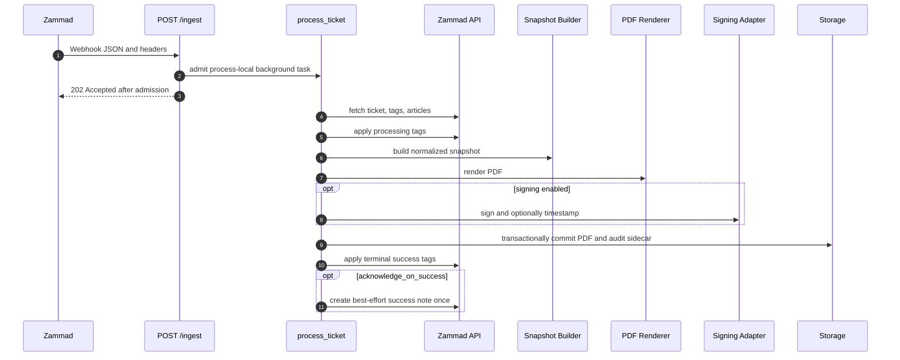
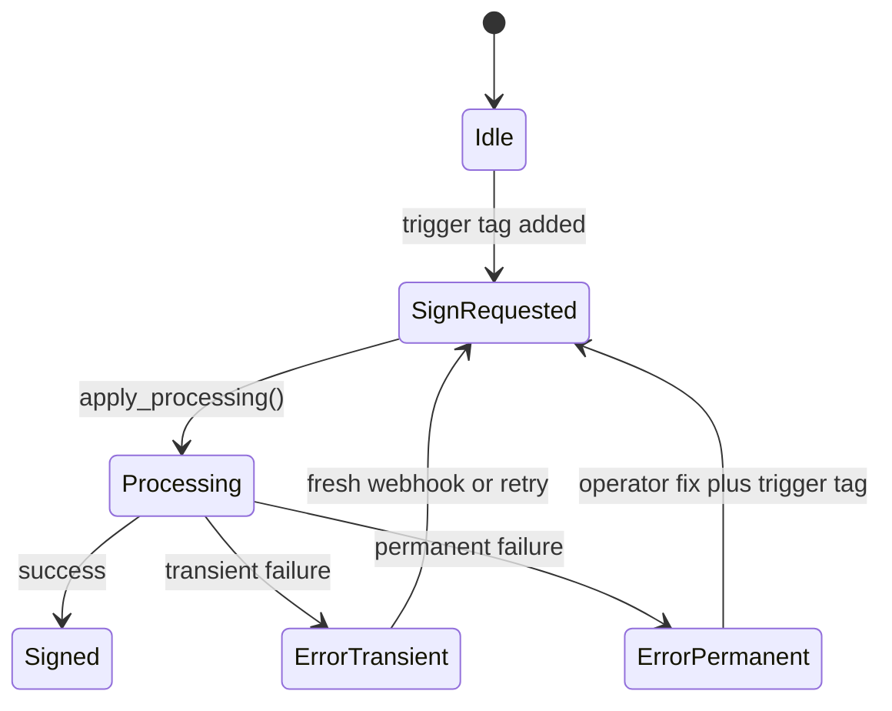

# 01 - Architecture

Chronikwerk is a single FastAPI service with process-local background
processing.

## Runtime Flow

Admission, archive commit, terminal tag finalization, and acknowledgement are
separate boundaries. The storage commit happens before terminal Zammad updates.
If terminal tag updates fail, the PDF and sidecar remain authoritative even when
the ticket is moved toward `pdf:error` or retains a partial state such as
`pdf:processing`. Once terminal success tags have been applied, success-note
creation is best effort and a note failure does not undo the archive or tags.

## Tag State Machine

Default tags:

- trigger: `pdf:sign`
- processing: `pdf:processing`
- success: `pdf:signed`
- failure: `pdf:error`

## Module Boundaries

| Area | Paths | Responsibility |
| --- | --- | --- |
| App and routes | `src/chronikwerk/app/` | FastAPI setup, middleware, HTTP routes, admission, process-local history, and the feature-flagged admin control plane. |
| Zammad adapter | `src/chronikwerk/adapters/zammad/` | Resource-oriented ticket operations behind a private policy-checked HTTP transport. |
| Snapshot adapter | `src/chronikwerk/adapters/snapshot/` | Normalize Zammad data into render input. |
| PDF adapter | `src/chronikwerk/adapters/pdf/` | Render HTML and PDF bytes. |
| Signing adapter | `src/chronikwerk/adapters/signing/` | PAdES signing and RFC3161 timestamping. |
| Storage adapter | `src/chronikwerk/adapters/storage/` | Root-confined filesystem writes. |
| Domain | `src/chronikwerk/domain/` | Pure policy, models, validation, and error classification. |
| Config | `src/chronikwerk/config/` | Settings, precedence, redaction, validation, and atomic managed non-secret revisions. |

## Important Runtime Constraints

- Background work is process-local by default.
- Delivery-ID dedupe and history are in-memory.
- Filesystem safety depends on both app path policy and the mounted storage.
- Signing and timestamping are optional and fail the job when enabled but invalid.
- Admin sessions and history disappear on restart; managed configuration revisions live
  in `admin.state_dir` and become active only after an external restart.
- Admin is disabled by default and is not a substitute for archive browsing, durable
  queues, secret management, or infrastructure control.
- Archive persistence and Zammad finalization are not one distributed transaction;
  reconciliation remains an operator workflow.
