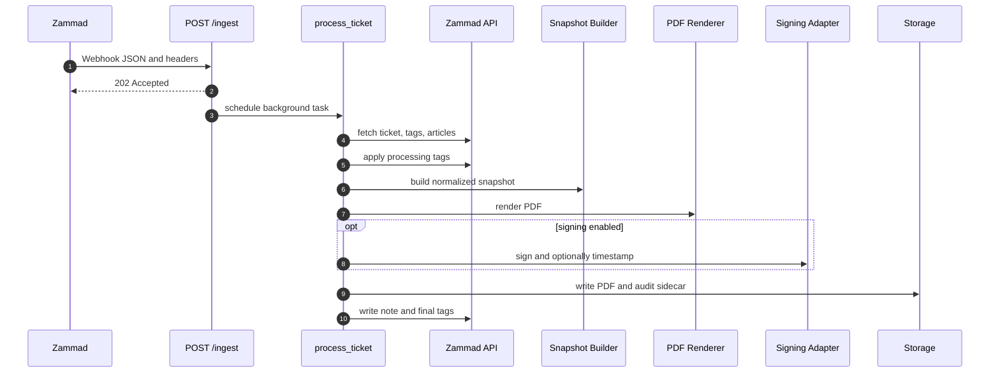
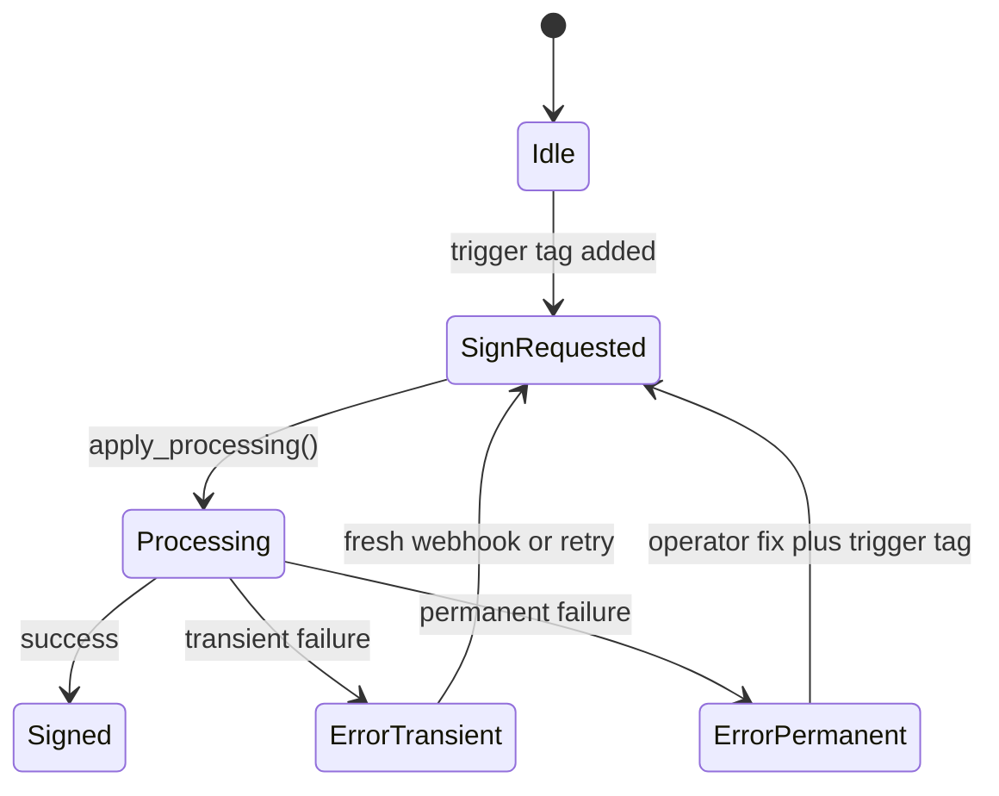

# 01 - Architecture

`zammad-pdf-archiver` is a single FastAPI service with process-local background
processing.

## Runtime Flow

## Tag State Machine

Default tags:

- trigger: `pdf:sign`
- processing: `pdf:processing`
- success: `pdf:signed`
- failure: `pdf:error`

## Module Boundaries

| Area | Paths | Responsibility |
| --- | --- | --- |
| App and routes | `src/zammad_pdf_archiver/app/` | FastAPI setup, middleware, HTTP routes, admission, process-local history, and the feature-flagged admin control plane. |
| Zammad adapter | `src/zammad_pdf_archiver/adapters/zammad/` | Ticket/articles/tags fetches and ticket updates. |
| Snapshot adapter | `src/zammad_pdf_archiver/adapters/snapshot/` | Normalize Zammad data into render input. |
| PDF adapter | `src/zammad_pdf_archiver/adapters/pdf/` | Render HTML and PDF bytes. |
| Signing adapter | `src/zammad_pdf_archiver/adapters/signing/` | PAdES signing and RFC3161 timestamping. |
| Storage adapter | `src/zammad_pdf_archiver/adapters/storage/` | Root-confined filesystem writes. |
| Domain | `src/zammad_pdf_archiver/domain/` | Pure policy, models, validation, and error classification. |
| Config | `src/zammad_pdf_archiver/config/` | Settings, precedence, redaction, validation, and atomic managed non-secret revisions. |

## Important Runtime Constraints

- Background work is process-local by default.
- Delivery-ID dedupe and history are in-memory.
- Filesystem safety depends on both app path policy and the mounted storage.
- Signing and timestamping are optional and fail the job when enabled but invalid.
- Admin sessions and history disappear on restart; managed configuration revisions live
  in `admin.state_dir` and become active only after an external restart.
- Admin is disabled by default and is not a substitute for archive browsing, durable
  queues, secret management, or infrastructure control.
