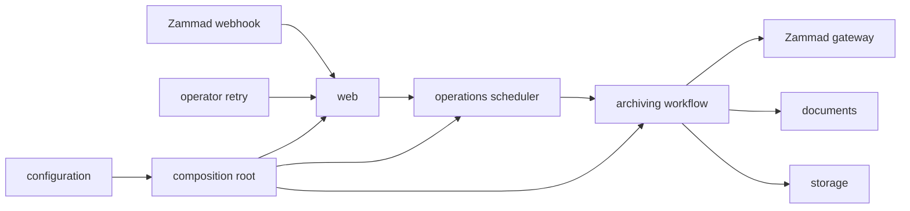
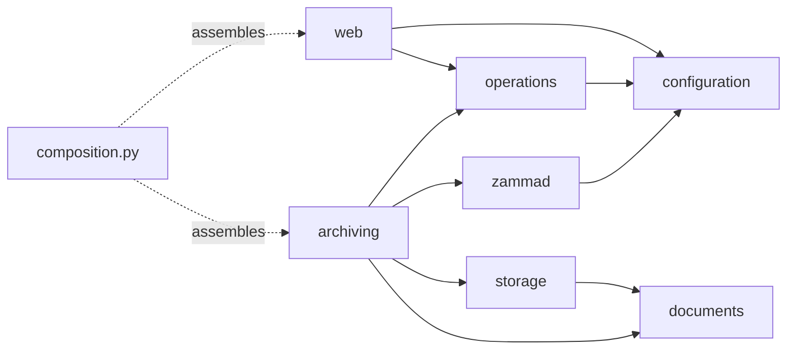

# Architecture

Chronikwerk is a modular monolith. One FastAPI process accepts authenticated Zammad webhooks and
operator retries, runs bounded background archive work, transactionally publishes a PDF and a JSON
audit sidecar, and projects the outcome back to Zammad.

## Runtime flow

```mermaid
flowchart LR
  Z[Zammad webhook] --> W[web]
  O[operator retry] --> W
  W --> Q[operations scheduler]
  Q --> A[archiving workflow]
  A --> ZG[Zammad gateway]
  A --> D[documents]
  A --> S[storage]
  C[configuration] --> X[composition root]
  X --> W
  X --> Q
  X --> A
```

`POST /ingest` and the retry endpoints return `202` only after process-local admission. The archive
workflow then fetches ticket data, checks the trigger state, marks the ticket as processing,
normalizes and sanitizes the snapshot, renders and optionally signs the PDF, transactionally
publishes the PDF and sidecar, and applies terminal tags. The success note is best effort, attempted
after storage and the terminal tags have succeeded.

## Modules

| Module | Responsibility |
| --- | --- |
| `composition.py` | Converts validated configuration into narrow runtime options and builds the job-processing objects (history, guards, scheduler, Zammad client, processor). |
| `archiving/` | Workflow and outcomes, Zammad-to-snapshot mapping, tag state machine, notes, failure policy, retry, and archive paths. |
| `zammad/` | DTOs, policy-checked bounded transport, and the resource gateway. |
| `documents/` | Snapshot models, HTML sanitization, templates, PDF rendering, PAdES signing, and RFC 3161 timestamping. |
| `storage/` | Path layout, root-confined filesystem operations, audit records, and transactional PDF/sidecar publication. |
| `configuration/` | Settings model, precedence, validation, settings redaction, and managed non-secret revisions. |
| `operations/` | `TicketJob` envelopes, admission, scheduling and shutdown, delivery dedupe, ticket guards, job history, logging, and metrics. |
| `web/` | FastAPI app, public routes, middleware, administration UI/API, templates, and generated static assets. |

## Dependency direction

```mermaid
flowchart LR
  W[web] --> C[configuration]
  W --> O[operations]
  O --> C
  Z[zammad] --> C
  S[storage] --> D[documents]
  A[archiving] --> D
  A --> O
  A --> S
  A --> Z
  X[composition.py] -. assembles .-> W
  X -. assembles .-> A
```

Arrows point from a module to the modules it may import; they are permissions, not a claim that
every edge is present. `tests/unit/configuration/test_architecture.py` holds the authoritative map
and fails on any other edge or cycle.

- `composition.py` may import any concrete module it needs to assemble the process.
- `web` depends only on `configuration` and `operations`; it does not implement archival work.
- `archiving` is the only coordinator. `zammad`, `documents`, and `storage` never import it, and
  `documents` does not know Zammad wire formats or process mechanics; it depends only on shared
  leaves. `storage` imports document models only for types. `archiving` receives narrow options
  built by `composition.py` and imports no `configuration` module.
- Pure archive policy (`path`, `notes`, `tags`, `error_policy`) imports no feature package.
- Shared leaves at the package root import no other chronikwerk module: `failures.py`
  (error classification), `outbound.py` (HTTP/DNS trust and bounded response helpers),
  `timestamps.py`, `redaction.py` (the single secret scrubber), `concurrency.py`
  (cancellation-safe thread offloading), `i18n.py`, and `_version.py`.
  Add another root module only for a concept with several independent owners.
- Cross-package imports of underscore-prefixed implementation modules are forbidden. The old
  `app`, `adapters`, `domain`, `config`, and `observability` package families are gone.

## State and consistency

The PDF and JSON sidecar files are Chronikwerk's durable state. The sidecar is published last and
signals a complete archive pair. Managed non-secret configuration revisions are also durable and
become active after an external restart.

Admission reservations, running tasks, delivery-ID deduplication, per-ticket exclusion, job history,
and admin sessions are process-local. A crash can lose admitted work, and multiple instances can
race. These are explicit product contracts, not hidden infrastructure.

Archive publication and Zammad finalization are not one distributed transaction. If storage
succeeds but terminal tag changes fail, the archive pair stays authoritative and operators
reconcile the ticket state. Adding durable jobs, leases, or an outbox would change admission and
operational semantics and needs a separate product decision.

The composition root builds one `JobHistory`, one `TicketGuards` (in-flight locks and delivery
dedupe), one `TicketSchedulingService`, and one shared Zammad client, and passes them to
`create_app(settings, *, scheduler=None, history=None, cleanup=None)`; without a scheduler the app is
read-only. Request-serving state (admin sessions, the managed configuration store, rate-limit
buckets) is created per application by `create_app`. The remaining module-level state is deliberate:
process-wide Prometheus metrics, the PDF signer cache, and the WeasyPrint render lock. The processor
borrows the shared client and never opens or closes it.

On shutdown the scheduler's `aclose()` stops accepting work synchronously, closes admission, and
drains tracked jobs for `admission.shutdown_timeout_seconds`. It then cancels the remaining jobs and
awaits their cancellation finalizers. The web lifespan finally calls the injected cleanup callback,
which closes the shared Zammad client. See [ADR 0009](adr/0009-composition-owned-runtime-state.md).

## External boundaries

- **HTTP:** webhook, batch, retry, health, metrics, history, and administration contracts in
  [api.md](api.md).
- **Zammad:** fixed `/api/v1` resource shapes, token authentication, deny-by-default outbound
  transport policy, and workflow tags/notes.
- **Filesystem:** configured archive root, sanitized layout, descriptor-relative symlink-resistant
  writes, atomic replacement, and the JSON audit schema.
- **Documents:** packaged templates, PDF/UA-targeted rendering, an optional PAdES signature, and an
  optional RFC 3161 timestamp.
- **Deployment:** console scripts, Docker/Compose, and systemd interfaces documented in
  [deploy.md](deploy.md).

## Where code belongs

Put product rules, Zammad-to-snapshot mapping, tag transitions, and archive outcomes in `archiving`;
Zammad wire formats and calls in `zammad`; rendering and signing in `documents`; filesystem and audit
publication in `storage`; settings and managed revisions in `configuration`; volatile process
mechanics in `operations`; and HTTP/admin delivery in `web`. Shared code belongs in the module that
owns the concept, not in a generic helper package; new volatile state is built in `composition.py`
and passed in, not held in a module global.
