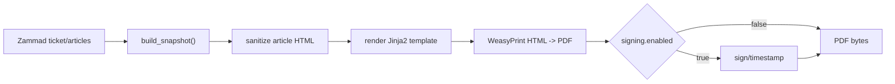

# 05 - PDF Rendering

The PDF pipeline builds a snapshot, renders bundled HTML templates, and converts
the result to PDF bytes with WeasyPrint.

## Pipeline

Code paths:

- `src/zammad_pdf_archiver/adapters/snapshot/build_snapshot.py`
- `src/zammad_pdf_archiver/adapters/pdf/template_engine.py`
- `src/zammad_pdf_archiver/adapters/pdf/render_pdf.py`
- `src/zammad_pdf_archiver/templates/`

## Template Contract

Bundled template:

- `src/zammad_pdf_archiver/templates/default/ticket.html`

Provided variables:

- `snapshot`
- `ticket` (`snapshot.ticket`)
- `articles` (`snapshot.articles`)

Article fields include:

- `id`
- `created_at`
- `internal`
- `sender`
- `subject`
- `body_html`
- `body_text`
- `attachments[]`

## HTML Safety

- Jinja autoescape is enabled.
- Article bodies marked as HTML (or containing common markup) are processed by
  a dependency-free allowlist sanitizer before rendering.
- Rich formatting, tables, and safe links are retained; scripts, styles, forms,
  event-handler/style attributes, and dangerous or scheme-relative URLs are
  removed.
- Malformed markup is recovered into a bounded fragment. If sanitization fails,
  the source is escaped and rendered through the plain-text fallback.
- Attachment binaries are not fetched or archived; attachment metadata is
  rendered only in the PDF.

## Limits

Relevant settings:

- `PDF__MAX_ARTICLES`
- `PDF__ARTICLE_LIMIT_MODE`
Attachments are represented as metadata only (`filename`, size, content type,
and IDs). Attachment binaries are not archived and there is no attachment-byte
limit setting. Article limits still fail the job or cap and continue according
to `PDF__MAX_ARTICLES` and `PDF__ARTICLE_LIMIT_MODE`.
