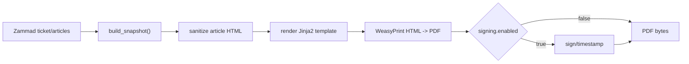

# 05 - PDF Rendering

The PDF pipeline builds a snapshot, renders bundled HTML templates, and converts
the result to PDF bytes with WeasyPrint.

## Pipeline

Code paths:

- `src/zammad_pdf_archiver/adapters/snapshot/build_snapshot.py`
- `src/zammad_pdf_archiver/adapters/pdf/template_engine.py`
- `src/zammad_pdf_archiver/adapters/pdf/render_pdf.py`
- `src/zammad_pdf_archiver/templates/`

## Template Contract

Bundled template:

- `src/zammad_pdf_archiver/templates/default/ticket.html`

Provided variables:

- `snapshot`
- `ticket` (`snapshot.ticket`)
- `articles` (`snapshot.articles`)

Article fields include:

- `id`
- `created_at`
- `internal`
- `sender`
- `subject`
- `body_html`
- `body_text`
- `attachments[]`

## HTML Safety

- Jinja autoescape is enabled.
- Article HTML is sanitized before rendering.
- Active content and event handlers are removed.
- Links are restricted to safe schemes such as `http`, `https`, and `mailto`.
- If sanitized HTML is empty, templates can fall back to plain text.

## Limits

Relevant settings:

- `PDF__MAX_ARTICLES`
- `PDF__ARTICLE_LIMIT_MODE`
- `PDF__MAX_TOTAL_ATTACHMENT_BYTES`

When limits are exceeded, behavior depends on configuration: fail the job or cap
and continue with an archive warning.
