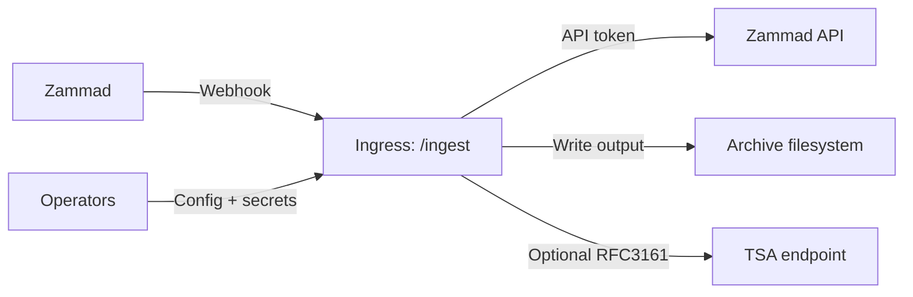

# 09 - Security

Security summary for the FastAPI webhook service.

## Trust Boundaries

## Security-Relevant Assets

- `ZAMMAD__WEBHOOK_HMAC_SECRET`
- `ZAMMAD__API_TOKEN`
- `RETRY_BEARER_TOKEN`
- `OBSERVABILITY__METRICS_BEARER_TOKEN`
- `SIGNING__PFX_PATH` and `SIGNING__PFX_PASSWORD`
- `SIGNING__TIMESTAMP__RFC3161__USER`
- `SIGNING__TIMESTAMP__RFC3161__PASSWORD`
- archived PDFs and audit sidecars

## Implemented Mitigations

### Forged Webhooks

- HMAC verification for `/ingest` and `/ingest/batch`.
- Fail-closed behavior when signed mode is required but no secret is configured.
- SHA-256 HMAC signatures are required; SHA-1 is not accepted.

### Replay and Duplicate Delivery

- Best-effort in-memory dedupe keyed by `X-Zammad-Delivery`.
- Optional strict delivery-ID requirement.

Residual risk: dedupe state is process-local and resets on restart.

### Path Traversal and Unsafe Writes

- Path segment validation and deterministic sanitization.
- Root confinement under `storage.root`.
- Symlink rejection under the storage root.
- Atomic PDF and sidecar writes.

Residual risk: filesystem behavior still depends on the mounted storage and OS.

### Secret Leakage

- Structured events and exception messages are scrubbed for known secret-like
  values.
- Ticket error notes use scrubbed exception text.

Residual risk: redaction is best-effort. Do not log raw config or full exception
objects in production.

### Request Flooding and Oversized Payloads

- Request body size limit middleware.
- Token-bucket rate limiting.

### Unsafe Upstream Transport

- HTTPS and certificate verification are required by default. Set
  `HARDENING__TRANSPORT__ALLOW_INSECURE_HTTP=true` only for an explicitly
  isolated test/internal deployment.
- Loopback, private, link-local, unspecified, reserved, and multicast address
  literals are rejected. DNS names are resolved off the event loop before the
  first outbound request and every returned address is checked; resolution
  failure is fail-closed. `HARDENING__TRANSPORT__ALLOW_PRIVATE_NETWORKS=true`
  is an explicit test/internal override.
- `trust_env` remains opt-in. Proxy configuration and DNS rebinding can still
  change the effective network path; enforce egress policy at the host or
  proxy boundary for production.

### Job History

`/jobs/history` is disabled by default. To expose it, enable
`OBSERVABILITY__HISTORY_ENABLED=true` and provide a dedicated non-blank
`OBSERVABILITY__HISTORY_BEARER_TOKEN`; configuration fails closed when the
token is missing.

## Hardening Checklist

- Restrict `/ingest` to trusted Zammad sources at the network edge.
- Configure and rotate `ZAMMAD__WEBHOOK_HMAC_SECRET`.
- Keep body-size and rate-limit controls enabled.
- Require delivery IDs when Zammad can send them reliably.
- Protect `/metrics` when enabled.
- Keep signing/TSA credentials outside the repository.
- Use a dedicated archive mount and service identity.
- Monitor archive write failures and ticket `pdf:error` notes.

## See Also

- [API reference](api.md)
- [Operations runbook](08-operations.md)
- [Release checklist](release-checklist.md)
