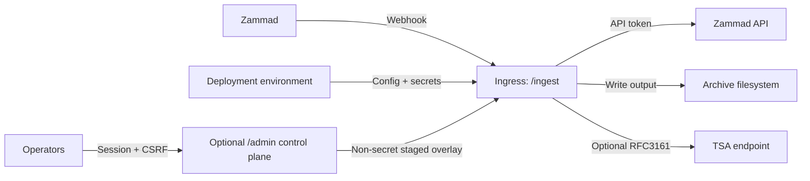

# 09 - Security

Security summary for the FastAPI webhook service.

## Trust Boundaries

## Security-Relevant Assets

- `ZAMMAD__WEBHOOK_HMAC_SECRET`
- `ZAMMAD__API_TOKEN` (portable alias: `ZAMMAD_API_TOKEN`)
- `RETRY_BEARER_TOKEN`
- `OBSERVABILITY__METRICS_BEARER_TOKEN`
- `OBSERVABILITY__HISTORY_BEARER_TOKEN`
- `SIGNING__PFX_PATH` and `SIGNING__PFX_PASSWORD`
- `SIGNING__TIMESTAMP__RFC3161__USER`
- `SIGNING__TIMESTAMP__RFC3161__PASSWORD`
- `ADMIN__ACCESS_TOKEN`
- archived PDFs and audit sidecars

## Implemented Mitigations

### Forged Webhooks

- HMAC verification for `/ingest` and `/ingest/batch`.
- Startup validation requires a random, non-placeholder webhook secret containing at
  least 32 characters. There is no supported unsigned mode.
- The middleware retains a defensive fail-closed `503` response if an application is
  constructed without validated settings.
- SHA-256 HMAC signatures are required; SHA-1 is not accepted.

### Replay and Duplicate Delivery

- Best-effort in-memory dedupe keyed by `X-Zammad-Delivery`, with a fail-closed
  10,000-entry process-local bound.
- Optional strict delivery-ID mode authenticates the normalized delivery ID as
  part of the SHA-256 HMAC input, so a captured body/signature cannot be replayed
  under a fresh ID. The canonical byte format is documented in `docs/api.md`.

Residual risk: dedupe state is process-local and resets on restart.

### Path Traversal and Unsafe Writes

- Path segment validation and deterministic sanitization.
- Root confinement under `storage.root`.
- Symlink rejection under the storage root.
- Atomic PDF and sidecar writes.

Residual risk: filesystem behavior still depends on the mounted storage and OS.

### Secret Leakage

- Structured events and exception messages are scrubbed for known secret-like
  values, including compound client credentials and escaped quoted values.
- Ticket error notes use scrubbed exception text.

Residual risk: redaction is best-effort. Do not log raw config or full exception
objects in production.

Repository policy ignores local environment files, YAML overrides, credential and
signing material, archive PDFs, admin state, local evidence, and development
tool state. Public examples contain placeholders only. A clean checkout or published
image, not a developer working tree, is the deployment input.

### Request Flooding and Oversized Payloads

- Request body size limit middleware.
- Token-bucket rate limiting.
- Deep storage health probes are single-flight; concurrent deep requests fail
  with `503` instead of queueing more filesystem work.

Residual risk: deep probes are unauthenticated, perform a temporary archive-storage
write, and are not rate-limited across sequential requests. Keep them on a trusted
operator path.

### Unsafe Upstream Transport

- HTTPS and certificate verification are required by default. Set
  `HARDENING__TRANSPORT__ALLOW_INSECURE_HTTP=true` only for an explicitly
  isolated test/internal deployment.
- Loopback, private, link-local, unspecified, reserved, and multicast address
  literals are rejected. DNS names are resolved off the event loop before the
  first outbound request and every returned address is checked; resolution
  failure is fail-closed. `HARDENING__TRANSPORT__ALLOW_PRIVATE_NETWORKS=true`
  is an explicit test/internal override.
- `trust_env` remains opt-in. Proxy configuration and DNS rebinding can still
  change the effective network path; enforce egress policy at the host or
  proxy boundary for production.

### Job History

`/jobs/history` is disabled by default. To expose it, enable
`OBSERVABILITY__HISTORY_ENABLED=true` and provide a dedicated non-blank
`OBSERVABILITY__HISTORY_BEARER_TOKEN`; configuration fails closed when the
token is missing.

### Administration application

The `/admin` surface is absent unless explicitly enabled. Enabling it without an access
token of at least 32 characters fails startup validation. Login uses a constant-time token
comparison and creates a random process-local session; the access token never enters the
cookie. Cookies are `HttpOnly`, `SameSite=Strict`, scoped to `/admin`, and secure by
default. Sessions have idle and absolute lifetimes and disappear on restart.

State-changing operations require a per-session CSRF token. Admin responses are
`no-store` and enforce a same-origin CSP, frame denial, `nosniff`, and no-referrer policy.
Managed configuration is restricted to an explicit non-secret registry, rejects unknown
and environment-owned fields, writes atomically with an `If-Match` revision precondition,
and never stores secret values. Existing managed-state directories must be owned by the
service identity and must not be group- or world-writable. Every POSIX path component is
opened without following symlinks, and directory identities are rechecked before reads,
writes, pruning, or rollback. The UI cannot restart the service.

## Hardening Checklist

- Restrict `/ingest` to trusted Zammad sources at the network edge.
- Configure and rotate a random, non-placeholder `ZAMMAD__WEBHOOK_HMAC_SECRET`
  of at least 32 characters.
- Keep body-size and rate-limit controls enabled.
- Require delivery IDs when Zammad can send them reliably.
- Protect `/metrics` when enabled.
- Keep admin disabled until the release gates pass; when enabled, place it behind TLS and
  the existing trusted-network boundary and rotate `ADMIN__ACCESS_TOKEN` externally.
- Keep signing/TSA credentials outside the repository.
- Mount the PFX as a bounded, read-only regular file with service-account ownership;
  do not use a symlink or group- or world-writable key file.
- Use a dedicated archive mount and service identity.
- Block `/docs`, `/redoc`, and `/openapi.json` at the trusted proxy when interactive API
  documentation is not required. These endpoints are unauthenticated in this candidate.
- Treat service logs and internal Zammad notes as sensitive operational data. They can
  contain delivery identifiers and absolute archive paths.
- Monitor archive write failures and ticket `pdf:error` notes.

## See Also

- [API reference](api.md)
- [Operations runbook](08-operations.md)
- [Release checklist](release-checklist.md)
