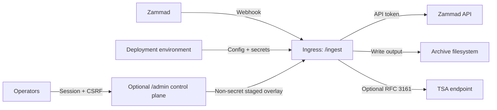

# Security

How the FastAPI webhook service protects its trust boundaries, and what it does not protect
against.

## Trust boundaries

```mermaid
flowchart LR
  Z["Zammad"] -->|"Webhook"| I["Ingress: /ingest"]
  OP["Operators"] -->|"Session + CSRF"| A["Optional /admin control plane"]
  DEP["Deployment environment"] -->|"Config + secrets"| I
  A -->|"Non-secret staged overlay"| I
  I -->|"API token"| ZA["Zammad API"]
  I -->|"Write output"| FS["Archive filesystem"]
  I -->|"Optional RFC 3161"| TSA["TSA endpoint"]
```

## Assets worth protecting

- `ZAMMAD__WEBHOOK_HMAC_SECRET`
- `ZAMMAD__API_TOKEN` (portable alias: `ZAMMAD_API_TOKEN`)
- `RETRY_BEARER_TOKEN`
- `OBSERVABILITY__METRICS_BEARER_TOKEN`
- `OBSERVABILITY__HISTORY_BEARER_TOKEN`
- `SIGNING__PFX_PATH` and `SIGNING__PFX_PASSWORD`
- `SIGNING__TIMESTAMP__RFC3161__USER`
- `SIGNING__TIMESTAMP__RFC3161__PASSWORD`
- `ADMIN__ACCESS_TOKEN`
- archived PDFs and audit sidecars

## Implemented mitigations

### Forged webhooks

- `/ingest` and `/ingest/batch` verify an HMAC.
- Startup validation requires a random, non-placeholder webhook secret of at least 32 characters.
  There is no supported unsigned mode.
- The middleware keeps a defensive fail-closed `503` response if an application is constructed
  without validated settings.
- Only SHA-256 HMAC signatures are accepted; SHA-1 is not.

### Replay and duplicate delivery

- Best-effort in-memory dedupe keyed by `X-Zammad-Delivery`, with a fail-closed 10,000-entry
  process-local bound.
- Optional strict delivery-ID mode authenticates the normalized delivery ID as part of the SHA-256
  HMAC input, so a captured body and signature cannot be replayed under a fresh ID. The canonical
  byte format is documented in [api.md](api.md).

Residual risk: dedupe state is process-local and resets on restart.

### Path traversal and unsafe writes

- Path segments are validated and deterministically sanitized.
- Final paths stay confined under `storage.root`.
- Symlinks under the storage root are rejected.
- PDF and sidecar writes are atomic.

Residual risk: filesystem behavior still depends on the mounted storage and the OS.

### Secret leakage

- Structured events and exception messages are scrubbed for known secret-like values, including
  compound client credentials and escaped quoted values.
- Ticket error notes use scrubbed exception text.
- One shared scrubber (`chronikwerk/redaction.py`) serves logs and error notes;
  `configuration/redaction.py` only redacts settings dumps.

Residual risk: redaction is best-effort. Do not log raw config or full exception objects in
production.

Repository policy ignores local environment files, YAML overrides, credential and signing material,
archive PDFs, admin state, local evidence, and development tool state. Public examples contain
placeholders only. Deploy from a clean checkout or a published image, not from a developer working
tree.

### Request flooding and oversized payloads

- Request body size limit middleware.
- Token-bucket rate limiting.
- Deep storage health probes are single-flight; concurrent deep requests fail with `503` instead of
  queueing more filesystem work.

Residual risk: deep probes are unauthenticated, perform a temporary archive-storage write, and are
not rate-limited across sequential requests. Keep them on a trusted operator path.

### Unsafe upstream transport

- HTTPS and certificate verification are required by default. Set
  `HARDENING__TRANSPORT__ALLOW_INSECURE_HTTP=true` only for an isolated test or internal
  deployment.
- Loopback, private, link-local, unspecified, reserved, and multicast address literals are rejected.
  DNS names are resolved off the event loop before the first outbound request, every returned
  address is checked, and resolution failure is fail-closed.
  `HARDENING__TRANSPORT__ALLOW_PRIVATE_NETWORKS=true` is an explicit test/internal override.
- `trust_env` stays opt-in. Proxy configuration and DNS rebinding can still change the effective
  network path, so enforce egress policy at the host or proxy boundary in production.

### Job history

`/jobs/history` is disabled by default. To expose it, enable `OBSERVABILITY__HISTORY_ENABLED=true`
and provide a dedicated non-blank `OBSERVABILITY__HISTORY_BEARER_TOKEN`; configuration fails closed
when the token is missing.

### Administration application

The admin surface does not exist unless you enable it, and enabling it without an access
token of at least 32 characters fails startup validation. Login uses a constant-time token
comparison and creates a random process-local session; the access token never enters the cookie.
Cookies are `HttpOnly`, `SameSite=Strict`, scoped to the admin path, and secure by default.
Sessions have idle and absolute lifetimes and disappear on restart.

State-changing operations require a per-session CSRF token. Admin responses are `no-store` and
enforce a same-origin CSP, frame denial, `nosniff`, and a no-referrer policy. Managed configuration
is restricted to an explicit non-secret registry, rejects unknown and environment-owned fields,
writes atomically with an `If-Match` revision precondition, and never stores secret values. Existing
managed-state directories must be owned by the service identity and must not be group- or
world-writable. Every POSIX path component is opened without following symlinks, and directory
identities are rechecked before reads, writes, pruning, or rollback. The UI cannot restart the
service.

## Hardening checklist

- Restrict `/ingest` to trusted Zammad sources at the network edge.
- Configure and rotate a random, non-placeholder `ZAMMAD__WEBHOOK_HMAC_SECRET` of at least 32
  characters.
- Keep body-size and rate-limit controls enabled.
- Require delivery IDs when Zammad can send them reliably.
- Protect `/metrics` when enabled.
- Keep admin disabled until the release gates pass; when enabled, place it behind TLS and the
  existing trusted-network boundary and rotate `ADMIN__ACCESS_TOKEN` externally.
- Keep signing and TSA credentials outside the repository.
- Mount the PFX as a bounded, read-only regular file owned by the service account; do not use a
  symlink or a group- or world-writable key file.
- Use a dedicated archive mount and service identity.
- Block `/docs`, `/redoc`, and `/openapi.json` at the trusted proxy when interactive API
  documentation is not required — they are unauthenticated in this candidate.
- Treat service logs and internal Zammad notes as sensitive operational data; they can contain
  delivery identifiers and absolute archive paths.
- Monitor archive write failures and ticket `pdf:error` notes.

## See also

- [API reference](api.md)
- [Operations runbook](08-operations.md)
- [Release checklist](release-checklist.md)
