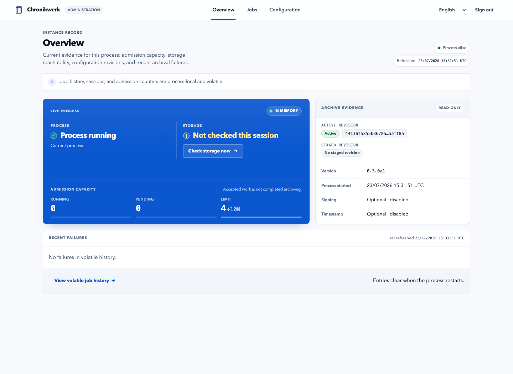
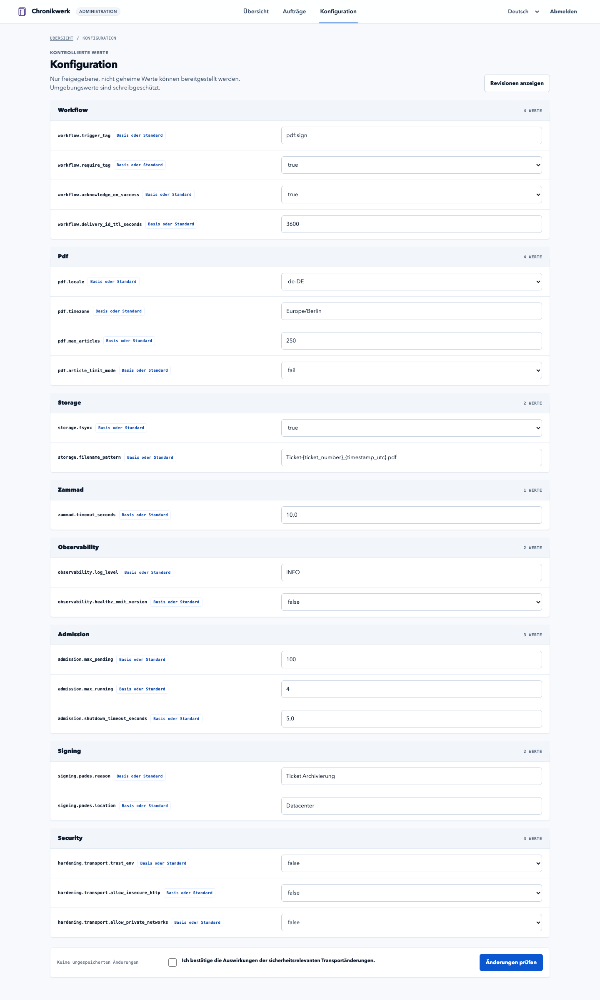

# Administration screenshots

These documentation renders use authenticated HTML produced by the real unfrozen
`0.3.0a1` FastAPI candidate, the shipped administration CSS, synthetic local
configuration, and no production endpoint, credential, ticket content, or archive data.

## English overview



## German configuration



The source HTML is rendered to PNG with the repository's pinned headless Chromium and
Playwright versions. JavaScript is removed so the previews remain fixed to their authenticated
initial page state. These are browser-rendered previews, but they are not browser interaction,
accessibility, or release evidence. The interface remains disabled by default. Machine-readable
capture details and file checksums are in [manifest.json](manifest.json).

Regenerate the previews from the current source with:

```bash
make docs-screenshots
make docs-check
```

Run the target from an activated development environment after `make frontend-install` and
`make browser-setup` have installed the pinned local tooling and browser binary:

```bash
make docs-screenshots PYTHON=.venv/bin/python
```

For a byte-for-byte replay, pass the manifest's `rendered_at_utc` value as
`CAPTURED_AT`, for example:

```bash
make docs-screenshots CAPTURED_AT=2026-07-19T12:00:00Z
```

`make docs-screenshots-verify` performs the same replay without replacing the tracked
files. Exact raster comparison depends on the recorded Chromium and compatible system
fonts, so this target is intentionally separate from the cross-platform `verify-core`
gate. `verify-core` retains portable source, manifest, dimension, and image-checksum
validation through `docs-check`.

The manifest records a selected bundle of application, template, translation, and CSS
inputs used by these renders. `make docs-check` fails when a recorded source, dimensions,
or image checksum drifts. Full browser interaction and assistive-technology evidence must
still be recaptured against the frozen tag before publication.
