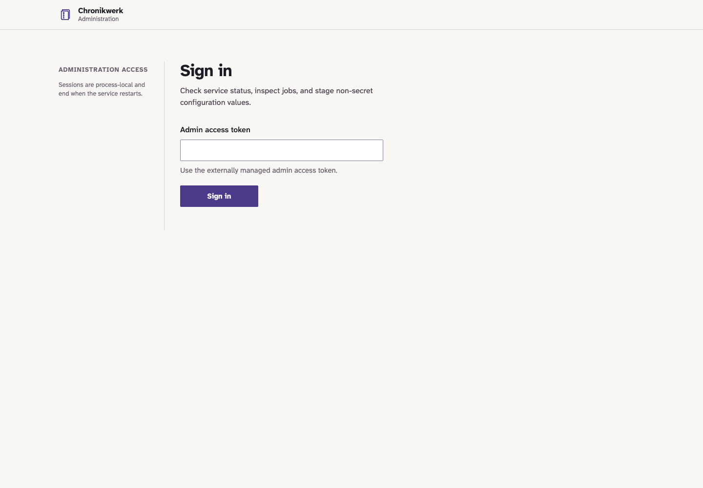

# Administration screenshots

Documentation renders of the optional administration application. They come from the real
server-rendered templates with synthetic local data, so they contain no production endpoint,
credential, ticket content, or archive data.

## Tour

**Overview (English)** — process health, capacity, recent failures, and configuration state, with
the volatility of process-local work called out at the top.

**Jobs (English)** — a filterable record of recent processing events.

**Ticket history (English)** — one ticket's processing timeline and the acknowledged retry action.

**Configuration (German)** — grouped, allowlisted non-secret values with inline provenance and a
review panel.

**Configuration revisions (German)** — active and staged revisions with a restore review.

**Sign in (English)** — the access-token login page.

## What these are not

These images are documentation references only. They are not browser, accessibility, Zammad,
storage, signing, or PDF evidence, so full browser and assistive-technology evidence still has to
be captured separately before any publication claim. The interface remains disabled by default.

[manifest.json](manifest.json) records each image's checksum, locale, route, and dimensions, and
`make docs-check` validates it. The pages are rendered by
[`tests/browser/render_overview.py`](../../tests/browser/render_overview.py).
